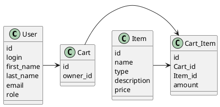

# Компонентная архитектура
<!-- Состав и взаимосвязи компонентов системы между собой и внешними системами с указанием протоколов, ключевые технологии, используемые для реализации компонентов.
Диаграмма контейнеров C4 и текстовое описание. 
-->
## Компонентная диаграмма

```plantuml
@startuml
!include https://raw.githubusercontent.com/plantuml-stdlib/C4-PlantUML/master/C4_Container.puml

AddElementTag("microService", $shape=EightSidedShape(), $bgColor="CornflowerBlue", $fontColor="white", $legendText="microservice")
AddElementTag("storage", $shape=RoundedBoxShape(), $bgColor="lightSkyBlue", $fontColor="white")

Person(admin, "Администратор")
Person(customer, "Покупатель")

System_Ext(web_site, "Клиентский веб-сайт", "HTML, CSS, JavaScript, React", "Веб-интерфейс")

System_Boundary(shop_site, "Магазин") {
   'Container(web_site, "Клиентский веб-сайт", ")
   Container(client_service, "Сервис авторизации", "C++", "Сервис управления пользователями", $tags = "microService")    
   Container(post_service, "Сервис товаров", "C++", "Сервис управления товарами", $tags = "microService") 
   Container(blog_service, "Сервис покупок", "C++", "Сервис управления корзинами", $tags = "microService")   
   ContainerDb(db, "База данных", "MariaDB", "Хранение данных о товарах, корзинах и пользователях", $tags = "storage")
   
}

Rel(admin, web_site, "Регистрация, просмотр, добавление и редактирование информации о товарах")
Rel(customer, web_site, "Регистрация, просмотр информации о товарах, добавление/удаление товаров из корзины")

Rel(web_site, client_service, "Работа с пользователями", "localhost/person")
Rel(client_service, db, "INSERT/SELECT/UPDATE/DELETE", "SQL")

Rel(web_site, post_service, "Работа с товарами", "localhost/prod")
Rel(post_service, db, "INSERT/SELECT/UPDATE/DELETE", "SQL")

Rel(web_site, blog_service, "Работа с корзинами", "localhost/cart")
Rel(blog_service, db, "INSERT/SELECT/UPDATE/DELETE", "SQL")

@enduml
```
## Список компонентов  

### Сервис авторизации
**API**:
-	Создание нового пользователя
      - входные параметры: login, пароль, имя, фамилия, email, роль (администратор или покупатель)
      - выходные параметры: идентификатор пользователя
-	Поиск пользователя по логину
     - входные параметры:  login
     - выходные параметры: имя, фамилия, email, роль
-	Поиск пользователей по маске имени и фамилии
     - входные параметры: маска фамилии, маска имени
     - выходные параметры: массив пользователей
- Удаление пользователя 
  - входные параметры: идентификатор пользователя
  - выходные параметры: отсутствуют

### Сервис товаров
**API**:
- Создание товара
  - Входные параметры: название товара, категория, описание, цена
  - Выходыне параметры: идентификатор товара
- Изменение товара
  - Входные параметры: идентификатор товара, массив изменяемых параметров, массив новых значений изменяемых параметров
  - Выходыне параметры: отсутствуют
- Получение товара
  - Входные параметры: идентификатор товара
  - Выходные параметры: название, категория, описание, цена товара
- Получение списка всех товаров
  - Входные параметры: отсутствуют
  - Выходные параметры: массив товаров, где для каждого указаны его идентификатор, название, категория, описание, цена
- Удаление товара
  - Входные параметры: идентификатор товара
  - выходные параметры: отсутствуют
### Сервис покупок
<!-- Покупатель получает корзину после регистрации, корзина не меняется, меняется только список товаров в ней. При удалении пользователя, удаляется связанная с ним корзина
-->
**API**:
- Создание корзины
  - Входные параметры: идентификатор пользователя
  - Выходные параметры: идентификатор корзины
- Добавление товара в корзину
  - Входные параметры: идентификатор пользователя, идентификатор товара, количество добавляемых единиц товара
  - Выходные параметры: отсутствуют
- Удаление товара из корзины
  - Входные параметры: идентификатор пользователя, идентификатор товара, количество удаляемых единиц товара
  - Выходные параметры: отсутствуют
- Получение корзины для пользователя
  - Входные параметры: идентификатор пользователя
  - Выходные параметры: массив товаров в корзине пользователя
- Очищение корзины пользователя
  - Входные параметры: идентификатор пользователя
  - Выходные параметры: отсутствуют

### Модель данных
<!-- Cart_Item - ассоциативная таблица между товарами и корзинами, поле amount - количество данного товара в корзине
-->
